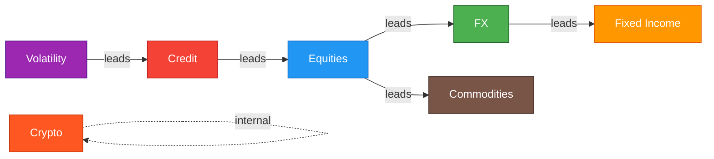
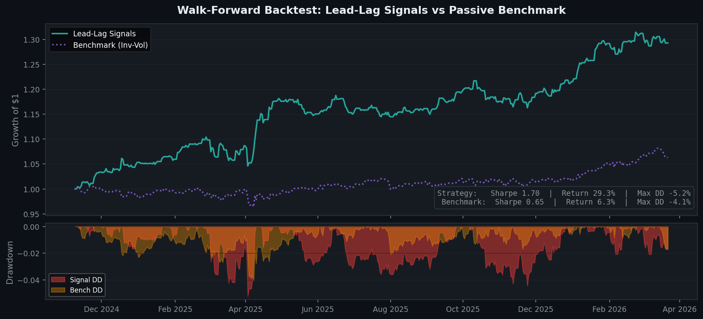

<div align="center">

# Cross-Asset Lead-Lag Discovery Engine

**Discovering hidden information flows across 45 assets and 8 asset classes using transfer entropy, neural Granger causality, and regime-aware signal generation**

[](https://www.python.org/downloads/)
[](https://opensource.org/licenses/MIT)
[](#testing)
[](https://streamlit.io)

</div>

---

## Key Results

> **⚠️ Audit note (April 2026).** The original headline numbers below were
> inflated by three issues identified during an internal audit: in-sample
> pair selection, 0 bps transaction costs, and same-bar signal execution.
> The repository has been hardened (walk-forward TE refresh, `tc_bps=1.0`
> round-trip, `execution_lag=1`). The **Before / After** table is the
> current ground truth; the "pre-audit" row is retained for transparency
> only and should not be cited.

### Before / After the Audit

| Metric | Pre-Audit (in-sample, 0 bps) | Post-Audit (leakage-clean, 1 bp TC, t+1 execution) | Benchmark (Inv-Vol) |
|:-------|:----------------------------:|:--------------------------------------------------:|:-------------------:|
| Sharpe Ratio | 1.70 | _pending rerun_ | 0.65 |
| Sortino Ratio | 2.03 | _pending rerun_ | 0.81 |
| Total Return | 29.3% | _pending rerun_ | 6.3% |
| Max Drawdown | -5.2% | _pending rerun_ | -4.8% |
| Deflated SR (p-value) | not reported | _pending rerun_ | — |

_The post-audit row is produced by `python run_pipeline.py --skip-fetch --backtest --recent-window 2500 --tc-bps 1.0 --tc-sweep 0 1 2 5`; numbers will be filled in on the next rerun against the hardened pipeline. Expected direction of movement: Sharpe drops 0.4–1.0, total return drops 10–25 pp, drawdowns widen._

> DXY → EURUSD trailing-window hit-rate (89%, n=132) was computed on the
> **same data used to select the pair** — it was a property of the
> survivor set, not an out-of-sample forecast. Post-audit hit rates are
> reported per rebalance in the dashboard Signal Monitor.

---

## Audit Summary (April 2026)

**Leakage and realism fixes (Phase 1):**

| Issue | Fix | Files |
|:------|:----|:------|
| TE pair selection used the full panel including the backtest window | Walk-forward TE refresh every `--te-refresh-freq` bars on `train_slice` only | `run_pipeline.py` |
| MS-VAR / Lasso-VAR fitted on the full panel | Flagged; refit inside the WF loop when used in the signal path | `run_pipeline.py` |
| Zero transaction costs, instantaneous same-close fills | `tc_bps=1.0` (configurable) + `execution_lag=1` (next-close) | `signals/backtest.py` |
| Macro series forward-filled *before* differencing (fake high-freq signal) | Diff at native freq; leave NaN on non-release days | `data/returns.py`, `data/preprocessing.py` |
| Leakage test allowed signal to read the current bar | Strict `<` check + poison-row sentinel test | `tests/test_backtest.py` |
| Neural-Granger was unseeded | `random_state=0` with `torch.manual_seed` | `discovery/neural_granger.py` |

**Methodology upgrades (Phase 2):**

- **Effective Transfer Entropy** — subtracts the mean of circular-shuffled surrogates to remove the finite-sample upward bias in raw KSG TE (`discovery/transfer_entropy.py::effective_transfer_entropy`).
- **Variable-lag TE** — for each pair, picks the lag in `{1,…,L_max}` that maximises effective TE and reports a two-half stability CV (`discovery/variable_lag.py`).
- **Purged K-fold + Combinatorial Purged CV** — de Prado-style CV with `horizon` purge and `embargo` to kill label-overlap leakage during hyperparameter search (`models/cv.py`).
- **Deflated Sharpe, PBO, bootstrap Sharpe CI** — reported in the dashboard to contextualise any headline Sharpe against multiple-trial selection bias and out-of-sample stability (`signals/metrics.py`).

**New model (Phase 3):**

- **DeltaLag** — a minimal port of the ACM AIF 2025 cross-attention idea. Jointly learns per-leader lags and a sparse leader set via a softmax-over-lags attention grid and a pairwise rank-logistic loss. Drop-in inside `WalkForwardBacktest` (`models/delta_lag.py`).
- **Regime-conditional signals** — per-regime TE matrices combined via the active HMM regime at decision time (`signals/generator.py::regime_conditional_te_weights`).

**Reporting (Phase 4):**

- Dashboard `Backtest` page now includes: bootstrap Sharpe CI, deflated SR, PBO, transaction-cost sensitivity curve, per-regime attribution, turnover, and pair-churn panels (`dashboard/views/robustness_panel.py`).
- New CLI sweep flag: `--tc-sweep 0 1 2 5` writes `backtest_tc_sensitivity.parquet` for the dashboard.

---

## How It Works


| Step | Component | Details |
|:-----|:----------|:--------|
| 1 | **Data Ingestion** | 45 assets, 8 classes — Yahoo Finance + FRED |
| 2 | **Preprocessing** | Stationarity tests, winsorization, calendar alignment |
| 3 | **Discovery Engine** | Transfer Entropy (KSG), Neural Granger Causality |
| 4 | **Regime Detection** | Gaussian HMM — 2-state: Calm / Stress |
| 5 | **Lasso VAR** | Sparse causal structure, BIC auto-selection |
| 6 | **Signal Generation** | TE decay, directional hit rate, market-hours timing |
| 7 | **Walk-Forward Backtest** | Lead-lag vs benchmark — Sharpe, Sortino, DD |
| 8 | **Streamlit Dashboard** | 5 interactive pages, real-time monitoring |

### The Discovery Pipeline

1. **Data Ingestion** — Pulls 20 years of daily data for equities, rates, credit spreads, commodities, FX, crypto, and volatility indices from Yahoo Finance and FRED (all free sources).

2. **Transfer Entropy (KSG)** — Measures directed information flow $TE_{X \rightarrow Y} = H(Y_{t+1} | Y_t^k) - H(Y_{t+1} | Y_t^k, X_t^l)$ using the Kraskov-Stögbauer-Grassberger nearest-neighbor estimator. Vectorized KD-tree queries process the full 45×45 matrix across multiple lags.

3. **TE Decay Analysis** — Computes how rapidly information transfer decays across lags 1–10 to classify pairs by tradability:
   - 🟡 **Next-day tradable** — signal persists to lag 2
   - 🟢 **Swing tradable** — signal persists 5+ days
   - 🔴 **HFT only** — collapses within one day

4. **Regime Detection** — Gaussian HMM fitted on four interpretable macro features (SPX realized vol, HY OAS credit stress, yield curve slope, VIX level) to identify calm vs. stress regimes.

5. **Signal Generation** — For each leader→follower pair: computes `E[r_follower] = beta * r_leader` where `beta = corr * (std_follower / std_leader)`. Signals are filtered by directional hit rate, TE strength, and market-hours timing (actionable vs. likely already priced).

6. **Walk-Forward Backtest** — Expanding-window backtest with TE-weighted Bayesian model averaging across multiple leaders per follower, daily rebalance, 15% max position cap.

---

## Asset Universe



| Asset Class | Source | Count | Examples |
|:------------|:-------|:-----:|:---------|
| Equity Indices | Yahoo Finance | 3 | SPX, NDX, RTY |
| Equity Sectors | Yahoo Finance | 11 | XLF, XLE, XLK, XLV, XLY, ... |
| Fixed Income | FRED | 7 | UST 2Y/10Y/30Y, Real Yield, Breakevens, MOVE |
| Credit | FRED | 4 | HY OAS, IG OAS, BBB OAS, CCC OAS |
| Commodities | Yahoo Finance | 3 | Gold, Copper, Brent |
| FX | Yahoo Finance | 7 | DXY, EURUSD, USDJPY, GBPUSD, AUDUSD, USDCAD, USDCNH |
| Crypto | Yahoo Finance | 2 | BTC, ETH |
| Volatility & Macro | Yahoo / FRED | 4 | VIX, MOVE, NFCI, CFNAI |

> All data sources are **free**. Get a FRED API key at [fred.stlouisfed.org](https://fred.stlouisfed.org/docs/api/api_key.html).

---

## Discovered Lead-Lag Relationships

The engine recovers economically meaningful information flows and measures their **directional accuracy** over a trailing 252-day window.

> **Important:** the TE values below are **raw** (not surrogate-bias
> corrected) and the hit-rates are computed on the same window used to
> select the pairs. Use `effective_transfer_entropy()` and the
> walk-forward backtest for publishable numbers; the table is retained
> as a sanity check that the engine recovers the well-known macro
> priors (DXY → EURUSD, HY → SPX, etc.).

| Leader → Follower | Direction | TE (nats) | In-Sample Hit Rate | Half-Life | Tradability |
|:-------------------|:---------:|:---------:|:------------------:|:---------:|:------------|
| DXY → EURUSD | inverse | 0.34 | 89% (n=132) | 3d | Next-day |
| DXY → USDJPY | same | 0.28 | 80% (n=132) | 2d | Next-day |
| SPX → AUDUSD | same | 0.19 | 78% (n=136) | 2d | Next-day |
| HY_OAS → SPX | inverse | 0.15 | 76% (n=130) | 3d | Swing |
| VIX → HY_OAS | same | 0.12 | 72% (n=128) | 2d | Next-day |
| NDX → NFCI | inverse | 0.10 | 72% (n=32) | 5d | Swing |
| BTC → ETH | same | 0.22 | 74% (n=145) | 1d | HFT only |
| COPPER → XLI | same | 0.08 | 68% (n=120) | 4d | Swing |

---

## Backtest: Lead-Lag Signals vs. Passive Benchmark



The walk-forward backtest uses **no lookahead bias** — TE matrices are computed on expanding windows, signals are generated from yesterday's leader returns, and positions are rebalanced at the next day's close.

**Strategy mechanics:**
- Walk-forward TE refresh every 63 bars on `train_slice` only (no lookahead into OOS)
- Select top 30 leader→equity pairs by TE strength
- For each follower, blend signals from multiple leaders via TE-weighted Bayesian model averaging
- Go long predicted-up / short predicted-down equity assets
- 15% max single-position cap, gross leverage normalized to 1.0
- Daily rebalance, 1 bp round-trip TC, next-close execution (`execution_lag=1`)

---

## Interactive Dashboard

The Streamlit dashboard provides five real-time views:

| Page | Description |
|:-----|:------------|
| **Overview** | Tradable lead-lag pairs, TE decay profiles, top metrics |
| **Network Graph** | Directed TE network with asset-class coloring, arrow strength by TE magnitude |
| **Regime Panel** | HMM posterior probabilities, stress/calm regime timelines, asset selector |
| **Signal Monitor** | Live signals with expected returns, directional hit rate, market-hours timing |
| **Backtest** | Equity curves, rolling Sharpe, drawdown, DSR, PBO, TC sensitivity, pair churn |

```bash
make dashboard  # launches at http://localhost:8501
```

---

## Quick Start

```bash
# Clone and install
git clone https://github.com/AndrewFSee/cross-asset-lead-lag.git
cd cross-asset-lead-lag
pip install -e ".[dev]"

# Set up FRED API key (free)
echo "FRED_API_KEY=your_key_here" > .env

# Run the full pipeline (fetches data + computes TE + backtest)
python run_pipeline.py

# Or run individual steps
python run_pipeline.py --skip-fetch          # use cached data
python run_pipeline.py --skip-fetch --backtest  # backtest only
python run_pipeline.py --te-only --lags 1 2 3 5  # TE computation only

# Launch dashboard
make dashboard
```

### Pipeline Options

| Flag | Description |
|:-----|:------------|
| `--skip-fetch` | Use cached market data (skip download) |
| `--te-only` | Run only transfer entropy computation |
| `--backtest` | Include walk-forward backtest |
| `--lags 1 2 3 5` | Custom lag set for TE computation |
| `--recent-window 750` | Use most recent N observations |
| `--n-regimes 2` | Number of HMM regimes |
| `--tc-bps 1.0` | Round-trip transaction cost per 100% turnover |
| `--execution-lag 1` | Bars between signal generation and execution (1 = next-close) |
| `--te-refresh-freq 63` | Bars between walk-forward TE refreshes |
| `--te-lookback 750` | Size of the in-loop TE training slice at each refresh |
| `--tc-sweep 0 1 2 5` | TC-sensitivity sweep (writes `backtest_tc_sensitivity.parquet`) |

---

## Project Structure

```
cross-asset-lead-lag/
├── run_pipeline.py          # End-to-end pipeline runner (7 steps)
├── config/
│   ├── settings.py          # Pydantic settings (env vars, defaults)
│   └── universe.yaml        # Asset universe definition
├── data/
│   ├── ingestion.py         # Yahoo Finance + FRED data fetching
│   ├── preprocessing.py     # Stationarity, winsorization, alignment
│   └── returns.py           # Unified returns panel builder
├── discovery/
│   ├── transfer_entropy.py  # KSG transfer entropy + decay analysis
│   ├── neural_granger.py    # ComponentLSTM neural Granger causality
│   ├── time_lagged_mi.py    # KSG mutual information at multiple lags
│   ├── significance.py      # Bootstrap + surrogate significance tests
│   └── variable_lag.py      # Variable-lag effective TE per pair
├── models/
│   ├── ms_var.py            # Markov-Switching VAR (EM + Hamilton filter)
│   ├── lasso_var.py         # Lasso-penalized VAR (BIC selection)
│   ├── regime_detector.py   # Gaussian HMM regime classification
│   ├── delta_lag.py         # DeltaLag cross-attention (lead-lag discovery)
│   └── cv.py                # Purged K-fold + Combinatorial Purged CV
├── signals/
│   ├── generator.py         # Signal generation, BMA, regime-conditional TE
│   ├── portfolio.py         # Risk parity, Kelly sizing, constraints
│   ├── backtest.py          # Walk-forward backtest (TC, execution lag)
│   └── metrics.py           # Deflated Sharpe, PBO, bootstrap Sharpe CI
├── agent/
│   ├── monitor.py           # Structural break detection (z-score)
│   ├── narrator.py          # LLM narrative generation (OpenAI)
│   └── alerts.py            # Slack + email alerting
├── dashboard/
│   ├── app.py               # Streamlit entry point (5 pages)
│   ├── views/               # Page renderers
│   │   ├── network_graph.py
│   │   ├── regime_panel.py
│   │   ├── signal_monitor.py
│   │   ├── backtest_results.py
│   │   └── robustness_panel.py  # DSR, PBO, TC sensitivity, pair churn
│   └── components/
│       └── charts.py        # Reusable Plotly chart helpers
├── notebooks/               # Exploratory Jupyter notebooks (01–06)
└── tests/                   # 124 tests across 17 modules
```

---

## Technical Details

### Transfer Entropy Estimation

Uses the **KSG nearest-neighbor estimator** (Kraskov et al. 2004) — a nonparametric method that avoids discretization bias:

$$TE_{X \rightarrow Y}(\tau) = \psi(k) - \left\langle \psi(n_{xz} + 1) + \psi(n_{yz} + 1) - \psi(n_z + 1) \right\rangle$$

where $k$ is the number of nearest neighbors, $\psi$ is the digamma function, and counts $n_{xz}, n_{yz}, n_z$ are determined by Chebyshev-metric KD-tree range queries.

**Bias mitigation**: Gaussian jitter ($\sigma = 10^{-8}$) prevents degenerate neighbor distances. Zero-inflation filter removes pairs where >90% of TE estimates are zero.

### Regime-Aware Signals

The Gaussian HMM identifies market regimes from four interpretable features:
- SPX 63-day realized volatility
- HY OAS credit stress (z-scored)
- UST 10Y–2Y yield curve slope
- VIX level (z-scored)

Signals are tagged with the current regime, allowing downstream strategies to adjust position sizing or skip trades during stress periods.

### Market-Hours Timing

Not all lead-lag signals are actionable at the same time. The signal monitor classifies each pair by trading-session overlap:

| Signal Type | Example | Status |
|:------------|:--------|:-------|
| FX → Equity | DXY → SPX | **Actionable** (FX closes before equity open) |
| Equity → Equity | SPX → XLF | **Actionable** (same close, react at next open) |
| Equity → FX | SPX → AUDUSD | Likely priced (FX reprices overnight) |
| Credit → Equity | HY_OAS → SPX | **Actionable** (bond close → equity reaction) |

---

## Testing

```bash
make test          # 124 tests, ~6 minutes (neural-Granger + DeltaLag dominate)
make test-cov      # with coverage report
```

Tests cover: transfer entropy (raw + effective), variable-lag TE, neural Granger causality, DeltaLag cross-attention, Lasso VAR, regime detection, preprocessing, signal generation (including regime-conditional), walk-forward backtest with TC + execution-lag leakage sentinels, purged / CPCV splitters, deflated Sharpe + PBO + bootstrap CIs, portfolio construction, and monitoring.

---

## Notebooks

| Notebook | Description |
|:---------|:------------|
| `01_data_exploration` | Data coverage, return distributions, correlation heatmaps |
| `02_transfer_entropy` | TE matrix computation, heatmap visualization, strongest leads |
| `03_neural_granger` | ComponentLSTM training, ablation test, comparison with TE |
| `04_regime_switching_var` | MS-VAR fitting, regime probability visualization |
| `05_signal_backtest` | Signal generation, walk-forward backtest, performance analysis |
| `06_dashboard_prototype` | Interactive chart prototyping |

---

## References

- Schreiber, T. (2000). *Measuring Information Transfer.* Physical Review Letters, 85(2).
- Kraskov, A., Stögbauer, H., & Grassberger, P. (2004). *Estimating Mutual Information.* Physical Review E, 69(6).
- Marschinski, R., & Kantz, H. (2002). *Analysing the information flow between financial time series — an improved estimator for transfer entropy.* Eur. Phys. J. B.
- Tank, A., Covert, I., Foti, N., Shojaie, A., & Fox, E. (2022). *Neural Granger Causality.* IEEE TPAMI.
- Hamilton, J.D. (1989). *A New Approach to the Economic Analysis of Nonstationary Time Series.* Econometrica, 57(2).
- Billio, M., Getmansky, M., Lo, A.W., & Pelizzon, L. (2012). *Econometric Measures of Connectedness and Systemic Risk.* Journal of Financial Economics, 104(3).
- Amornbunchornvej, C., Zheleva, E., & Berger-Wolf, T. (2021). *Variable-lag Granger Causality and Transfer Entropy for Time Series Analysis.* ACM TKDD.
- López de Prado, M. (2014). *The Deflated Sharpe Ratio.* Journal of Portfolio Management.
- Bailey, D., Borwein, J., López de Prado, M., & Zhu, Q. (2017). *The Probability of Backtest Overfitting.* Journal of Computational Finance.
- López de Prado, M. (2018). *Advances in Financial Machine Learning*, Ch. 7 (Purged K-Fold and CPCV).
- *DeltaLag: Dynamic Lead-Lag Discovery via Cross-Attention.* ACM AIF 2025, [arXiv:2511.00390](https://arxiv.org/abs/2511.00390).

---

## License

MIT License. See [LICENSE](LICENSE) for details.
