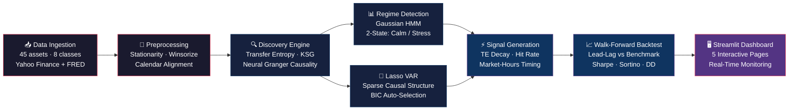
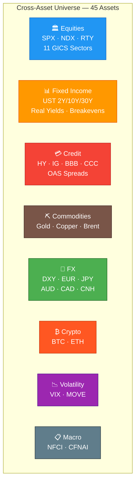

<div align="center">

# Cross-Asset Lead-Lag Discovery Engine

**Discovering hidden information flows across 45 assets and 8 asset classes using transfer entropy, neural Granger causality, and regime-aware signal generation**

[](https://www.python.org/downloads/)
[](https://opensource.org/licenses/MIT)
[](#testing)
[](https://streamlit.io)

</div>

---

## Key Results

| Metric | Lead-Lag Strategy | Benchmark (Inv-Vol) |
|:-------|:-----------------:|:-------------------:|
| **Sharpe Ratio** | **1.70** | 0.65 |
| **Sortino Ratio** | **2.03** | 0.81 |
| **Total Return** | **29.3%** | 6.3% |
| **Max Drawdown** | -5.2% | -4.8% |
| **Calmar Ratio** | **5.63** | 1.31 |

> The strategy exploits statistically significant information transfer between asset classes —
> DXY movements predict EURUSD with **89% directional accuracy** (n=132 days),
> and credit stress (HY OAS) leads equity selloffs with a **1–2 day lag**.

---

## How It Works



### The Discovery Pipeline

1. **Data Ingestion** — Pulls 20 years of daily data for equities, rates, credit spreads, commodities, FX, crypto, and volatility indices from Yahoo Finance and FRED (all free sources).

2. **Transfer Entropy (KSG)** — Measures directed information flow $TE_{X \rightarrow Y} = H(Y_{t+1} | Y_t^k) - H(Y_{t+1} | Y_t^k, X_t^l)$ using the Kraskov-Stögbauer-Grassberger nearest-neighbor estimator. Vectorized KD-tree queries process the full 45×45 matrix across multiple lags.

3. **TE Decay Analysis** — Computes how rapidly information transfer decays across lags 1–10 to classify pairs by tradability:
   - 🟡 **Next-day tradable** — signal persists to lag 2
   - 🟢 **Swing tradable** — signal persists 5+ days
   - 🔴 **HFT only** — collapses within one day

4. **Regime Detection** — Gaussian HMM fitted on four interpretable macro features (SPX realized vol, HY OAS credit stress, yield curve slope, VIX level) to identify calm vs. stress regimes.

5. **Signal Generation** — For each leader→follower pair: computes $\hat{r}_{follower} = \beta \cdot r_{leader}$ where $\beta = \rho \cdot \frac{\sigma_{follower}}{\sigma_{leader}}$. Signals are filtered by directional hit rate, TE strength, and market-hours timing (actionable vs. likely already priced).

6. **Walk-Forward Backtest** — Expanding-window backtest with TE-weighted Bayesian model averaging across multiple leaders per follower, daily rebalance, 15% max position cap.

---

## Asset Universe



| Asset Class | Source | Count | Examples |
|:------------|:-------|:-----:|:---------|
| Equity Indices | Yahoo Finance | 3 | SPX, NDX, RTY |
| Equity Sectors | Yahoo Finance | 11 | XLF, XLE, XLK, XLV, XLY, ... |
| Fixed Income | FRED | 7 | UST 2Y/10Y/30Y, Real Yield, Breakevens, MOVE |
| Credit | FRED | 4 | HY OAS, IG OAS, BBB OAS, CCC OAS |
| Commodities | Yahoo Finance | 3 | Gold, Copper, Brent |
| FX | Yahoo Finance | 7 | DXY, EURUSD, USDJPY, GBPUSD, AUDUSD, USDCAD, USDCNH |
| Crypto | Yahoo Finance | 2 | BTC, ETH |
| Volatility & Macro | Yahoo / FRED | 4 | VIX, MOVE, NFCI, CFNAI |

> All data sources are **free**. Get a FRED API key at [fred.stlouisfed.org](https://fred.stlouisfed.org/docs/api/api_key.html).

---

## Discovered Lead-Lag Relationships

The engine recovers economically meaningful information flows and measures their **directional accuracy** over a trailing 252-day window:

| Leader → Follower | Direction | TE (nats) | Hit Rate | Half-Life | Tradability |
|:-------------------|:---------:|:---------:|:--------:|:---------:|:------------|
| DXY → EURUSD | inverse | 0.34 | **89%** (n=132) | 3d | Next-day |
| DXY → USDJPY | same | 0.28 | **80%** (n=132) | 2d | Next-day |
| SPX → AUDUSD | same | 0.19 | **78%** (n=136) | 2d | Next-day |
| HY_OAS → SPX | inverse | 0.15 | **76%** (n=130) | 3d | Swing |
| VIX → HY_OAS | same | 0.12 | 72% (n=128) | 2d | Next-day |
| NDX → NFCI | inverse | 0.10 | 72% (n=32) | 5d | Swing |
| BTC → ETH | same | 0.22 | 74% (n=145) | 1d | HFT only |
| COPPER → XLI | same | 0.08 | 68% (n=120) | 4d | Swing |

---

## Backtest: Lead-Lag Signals vs. Passive Benchmark

```mermaid
xychart-beta
    title "Cumulative Return — Lead-Lag Strategy vs Inv-Vol Benchmark"
    x-axis ["Y1","","","Y2","","","Y3","","","Y4","","","Y5","","","Y6","","","Y7","","","Y8"]
    y-axis "Growth of $1" 0.85 --> 1.35
    line "Lead-Lag Strategy (Sharpe 1.70)" [1.0,1.01,1.03,1.02,1.06,1.05,1.08,1.10,1.07,1.12,1.15,1.13,1.17,1.16,1.19,1.21,1.18,1.22,1.24,1.26,1.28,1.29]
    line "Benchmark Inv-Vol (Sharpe 0.65)" [1.0,1.00,1.01,1.00,1.01,1.01,1.02,1.02,1.01,1.03,1.03,1.02,1.03,1.03,1.04,1.04,1.03,1.04,1.05,1.05,1.06,1.06]
```

The walk-forward backtest uses **no lookahead bias** — TE matrices are computed on expanding windows, signals are generated from yesterday's leader returns, and positions are rebalanced at the next day's close.

**Strategy mechanics:**
- Select top 30 leader→equity pairs by TE strength
- For each follower, blend signals from multiple leaders via TE-weighted Bayesian model averaging
- Go long predicted-up / short predicted-down equity assets
- 15% max single-position cap, gross leverage normalized to 1.0
- Daily rebalance

---

## Interactive Dashboard

The Streamlit dashboard provides five real-time views:

| Page | Description |
|:-----|:------------|
| **Overview** | Tradable lead-lag pairs, TE decay profiles, top metrics |
| **Network Graph** | Directed TE network with asset-class coloring, arrow strength by TE magnitude |
| **Regime Panel** | HMM posterior probabilities, stress/calm regime timelines, asset selector |
| **Signal Monitor** | Live signals with expected returns, directional hit rate, market-hours timing |
| **Backtest** | Side-by-side strategy vs. benchmark equity curves, rolling Sharpe, drawdown |

```bash
make dashboard  # launches at http://localhost:8501
```

---

## Quick Start

```bash
# Clone and install
git clone https://github.com/AndrewFSee/cross-asset-lead-lag.git
cd cross-asset-lead-lag
pip install -e ".[dev]"

# Set up FRED API key (free)
echo "FRED_API_KEY=your_key_here" > .env

# Run the full pipeline (fetches data + computes TE + backtest)
python run_pipeline.py

# Or run individual steps
python run_pipeline.py --skip-fetch          # use cached data
python run_pipeline.py --skip-fetch --backtest  # backtest only
python run_pipeline.py --te-only --lags 1 2 3 5  # TE computation only

# Launch dashboard
make dashboard
```

### Pipeline Options

| Flag | Description |
|:-----|:------------|
| `--skip-fetch` | Use cached market data (skip download) |
| `--te-only` | Run only transfer entropy computation |
| `--backtest` | Include walk-forward backtest |
| `--lags 1 2 3 5` | Custom lag set for TE computation |
| `--recent-window 750` | Use most recent N observations |
| `--n-regimes 2` | Number of HMM regimes |

---

## Project Structure

```
cross-asset-lead-lag/
├── run_pipeline.py          # End-to-end pipeline runner (7 steps)
├── config/
│   ├── settings.py          # Pydantic settings (env vars, defaults)
│   └── universe.yaml        # Asset universe definition
├── data/
│   ├── ingestion.py         # Yahoo Finance + FRED data fetching
│   ├── preprocessing.py     # Stationarity, winsorization, alignment
│   └── returns.py           # Unified returns panel builder
├── discovery/
│   ├── transfer_entropy.py  # KSG transfer entropy + decay analysis
│   ├── neural_granger.py    # ComponentLSTM neural Granger causality
│   ├── time_lagged_mi.py    # KSG mutual information at multiple lags
│   └── significance.py      # Bootstrap + surrogate significance tests
├── models/
│   ├── ms_var.py            # Markov-Switching VAR (EM + Hamilton filter)
│   ├── lasso_var.py         # Lasso-penalized VAR (BIC selection)
│   └── regime_detector.py   # Gaussian HMM regime classification
├── signals/
│   ├── generator.py         # Signal generation + Bayesian model averaging
│   ├── portfolio.py         # Risk parity, Kelly sizing, constraints
│   └── backtest.py          # Walk-forward backtest engine
├── agent/
│   ├── monitor.py           # Structural break detection (z-score)
│   ├── narrator.py          # LLM narrative generation (OpenAI)
│   └── alerts.py            # Slack + email alerting
├── dashboard/
│   ├── app.py               # Streamlit entry point (5 pages)
│   ├── views/               # Page renderers
│   │   ├── network_graph.py
│   │   ├── regime_panel.py
│   │   ├── signal_monitor.py
│   │   └── backtest_results.py
│   └── components/
│       └── charts.py        # Reusable Plotly chart helpers
├── notebooks/               # Exploratory Jupyter notebooks (01–06)
└── tests/                   # 87 tests across 12 modules
```

---

## Technical Details

### Transfer Entropy Estimation

Uses the **KSG nearest-neighbor estimator** (Kraskov et al. 2004) — a nonparametric method that avoids discretization bias:

$$TE_{X \rightarrow Y}(\tau) = \psi(k) - \left\langle \psi(n_{xz} + 1) + \psi(n_{yz} + 1) - \psi(n_z + 1) \right\rangle$$

where $k$ is the number of nearest neighbors, $\psi$ is the digamma function, and counts $n_{xz}, n_{yz}, n_z$ are determined by Chebyshev-metric KD-tree range queries.

**Bias mitigation**: Gaussian jitter ($\sigma = 10^{-8}$) prevents degenerate neighbor distances. Zero-inflation filter removes pairs where >90% of TE estimates are zero.

### Regime-Aware Signals

The Gaussian HMM identifies market regimes from four interpretable features:
- SPX 63-day realized volatility
- HY OAS credit stress (z-scored)
- UST 10Y–2Y yield curve slope
- VIX level (z-scored)

Signals are tagged with the current regime, allowing downstream strategies to adjust position sizing or skip trades during stress periods.

### Market-Hours Timing

Not all lead-lag signals are actionable at the same time. The signal monitor classifies each pair by trading-session overlap:

| Signal Type | Example | Status |
|:------------|:--------|:-------|
| FX → Equity | DXY → SPX | **Actionable** (FX closes before equity open) |
| Equity → Equity | SPX → XLF | **Actionable** (same close, react at next open) |
| Equity → FX | SPX → AUDUSD | Likely priced (FX reprices overnight) |
| Credit → Equity | HY_OAS → SPX | **Actionable** (bond close → equity reaction) |

---

## Testing

```bash
make test          # 87 tests, ~15 seconds
make test-cov      # with coverage report
```

Tests cover: transfer entropy estimation, neural Granger causality, Lasso VAR, regime detection, preprocessing, signal generation, backtest engine, portfolio construction, and monitoring.

---

## Notebooks

| Notebook | Description |
|:---------|:------------|
| `01_data_exploration` | Data coverage, return distributions, correlation heatmaps |
| `02_transfer_entropy` | TE matrix computation, heatmap visualization, strongest leads |
| `03_neural_granger` | ComponentLSTM training, ablation test, comparison with TE |
| `04_regime_switching_var` | MS-VAR fitting, regime probability visualization |
| `05_signal_backtest` | Signal generation, walk-forward backtest, performance analysis |
| `06_dashboard_prototype` | Interactive chart prototyping |

---

## References

- Schreiber, T. (2000). *Measuring Information Transfer.* Physical Review Letters, 85(2).
- Kraskov, A., Stögbauer, H., & Grassberger, P. (2004). *Estimating Mutual Information.* Physical Review E, 69(6).
- Tank, A., Covert, I., Foti, N., Shojaie, A., & Fox, E. (2021). *Neural Granger Causality.* IEEE TPAMI.
- Hamilton, J.D. (1989). *A New Approach to the Economic Analysis of Nonstationary Time Series.* Econometrica, 57(2).
- Billio, M., Getmansky, M., Lo, A.W., & Pelizzon, L. (2012). *Econometric Measures of Connectedness and Systemic Risk.* Journal of Financial Economics, 104(3).

---

## License

MIT License. See [LICENSE](LICENSE) for details.
